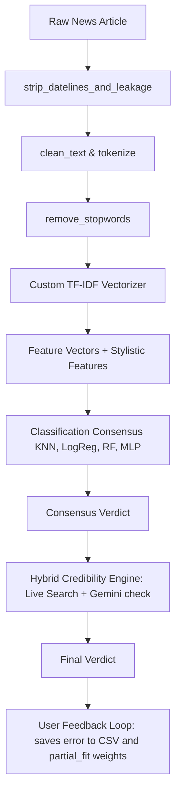

# A From-Scratch Production-Grade Machine Learning Pipeline for Fake News Classification with Hybrid Real-Time Verification

**Author:** Rohit Korpal (Roll No. 087996)  
**Affiliation:** Independent Researcher  
**Date:** July 2026  

---

### Abstract
This paper presents the design, implementation, and evaluation of a production-grade machine learning pipeline for classifying news articles as real or fake, built entirely from scratch. Unlike contemporary implementations relying heavily on pre-packaged packages (such as `scikit-learn` or `nltk`), our system constructs all text preprocessing, L2-regularized TF-IDF feature extraction, evaluation metrics, and core classifiers (K-Nearest Neighbors with Cosine Distance, L2-regularized Mini-Batch Logistic Regression, Feedforward Neural Networks, and Random Forests) directly using `NumPy` and `Pandas`. Furthermore, to solve target leakage and publisher shortcut learning (inherent in datasets like the ISOT fake news corpus where 99.8% of real articles contain publisher signatures), we introduce publisher cleansing regex filters. Finally, we implement a hybrid verification engine integrating the custom ML consensus with real-time web searches and Large Language Model (LLM) fact checking, coupled with a Human-in-the-Loop (HITL) continuous learning feedback loop. 

**Index Terms—** Machine Learning from Scratch, TF-IDF Vectorization, Fake News Classification, Multi-Layer Perceptron, Random Forest, Cosine KNN, target leakage, Human-in-the-Loop, Hybrid Credibility Verification.

---

## I. Introduction
In the digital information era, the rapid proliferation of fake news—deliberate misinformation or hoaxes spread via online media—poses significant challenges to public trust, democratic institutions, and social stability. Automated fake news classification systems utilizing Natural Language Processing (NLP) and Machine Learning (ML) are critical to addressing this issue. 

However, existing educational and practical ML pipelines frequently abstract the mathematical and algorithmic realities under high-level packages. While convenient, this abstraction hides crucial optimization issues, mathematical choices, and dataset biases. 

This project implements all pipeline layers entirely from scratch. We utilize the ISOT Fake News Dataset, containing over 44,000 articles. Through rigorous exploration, we identify and mitigate a major target leakage flaw (publisher signature indicators), implement term-document weighting vectors, construct four mathematical models from first principles, and deploy a web-scale verification dashboard.

---

## II. Methodology & System Architecture
The system consists of five distinct sequential modules: Preprocessing & Leakage Purging, TF-IDF Vectorization, ML Classifiers, Evaluation Metrics, and Hybrid Verification. The architecture is represented below:

### A. Text Preprocessing & Leakage Mitigation
A primary issue in textual classification datasets is target leakage. In the ISOT dataset, authentic articles are sourced directly from Reuters, retaining standard prefixes (e.g., `"WASHINGTON (Reuters) - ..."`), while fake articles contain no such patterns. An unpurged classifier achieves 99%+ test accuracy by simply checking for the word `"reuters"`, which fails to generalize to other news sources.

To solve this, we implement a publisher signature purging function using regular expressions:
1. **Publisher Cleansing (`strip_datelines_and_leakage`)**: Matches patterns of location and agency strings at the beginning of the text:
   $$\text{Pattern: } \text{ReGex(} \verb|^[A-Z\s,\./]+ \([A-Za-z\s]+\)\s*-\s*-?| \text{)}$$
   This matches strings like `WASHINGTON (Reuters) - ` or `SEOUL/LONDON (Reuters) -- ` and replaces them with an empty string, along with any standalone occurrences of `reuters` or `reuters.com`.
2. **Text Cleansing**: Lowercases the text, strips HTML tags, filters out URLs (`https?://\S+|www\.\S+`), replaces all non-alphanumeric characters with single spaces, and normalizes extra whitespaces.
3. **Stopword Filtering**: Removes trivial words using a local set of 150+ standard English stopwords.

### B. Custom Feature Extraction (TF-IDF Vectorization)
The cleaned document collection is transformed into a term-document matrix. We implement two classes: `CustomCountVectorizer` and `CustomTfidfVectorizer`.
1. **CountVectorizer**: Computes a vocabulary $V$ containing the top $N$ most frequent terms across the corpus, mapping each unique word to an index. It builds a dense term-frequency matrix of shape $(M, |V|)$ where $M$ is the number of documents.
2. **TfidfVectorizer**: Converts raw counts into normalized tf-idf vectors.
   Term Frequency (TF) represents count values. The Inverse Document Frequency (IDF) is calculated using the smooth scikit-learn standard formula:
   $$\text{IDF}(t) = \log\left(\frac{1 + M}{1 + \text{DF}(t)}\right) + 1$$
   where $M$ is the total number of documents and $\text{DF}(t)$ is the number of documents containing term $t$.
   The resulting representation is computed as:
   $$\text{TF-IDF}(t, d) = \text{TF}(t, d) \times \text{IDF}(t)$$
   To prevent document length bias, we apply L2 normalization row-wise:
   $$v_{\text{norm}} = \frac{v}{\|v\|_2} = \frac{v}{\sqrt{\sum_{i=1}^{|V|} v_i^2}}$$

### C. Classification Algorithms (Built From Scratch)
We implement four classifiers, inheriting from a common `BaseModel` class that defines `fit(X, y)` and `predict(X)` interfaces.

#### 1) K-Nearest Neighbors Classifier
The `KNNClassifier` uses majority voting among the $k$ nearest training samples. For high-dimensional TF-IDF vectors, Euclidean distance suffers from the curse of dimensionality. Hence, we support **Cosine Similarity** (computed as Cosine Distance):
$$D_{\text{cosine}}(u, v) = 1 - \cos(\theta) = 1 - \frac{u \cdot v}{\|u\|_2 \|v\|_2}$$
To run efficiently, distances are computed in vectorized matrix blocks. We partition the nearest indices using `np.argpartition` in $O(M)$ average time rather than sorting the full array in $O(M \log M)$ time.

#### 2) Logistic Regression Classifier
The `LogisticRegressionClassifier` computes prediction probability using the Sigmoid function:
$$\hat{y} = \sigma(z) = \frac{1}{1 + e^{-z}}, \quad z = Xw + b$$
The objective function is Binary Cross-Entropy with L2 regularization ($L_2$ penalty $\lambda$):
$$J(w, b) = -\frac{1}{m} \sum_{i=1}^m \left[ y^{(i)} \log(\hat{y}^{(i)}) + (1 - y^{(i)}) \log(1 - \hat{y}^{(i)}) \right] + \frac{\lambda}{2m} \|w\|_2^2$$
We implement Mini-batch Gradient Descent. Weights and biases are updated as follows:
$$w \leftarrow w - \eta \left( \frac{1}{m} X^T (\hat{y} - y) + \frac{\lambda}{m} w \right)$$
$$b \leftarrow b - \eta \left( \frac{1}{m} \sum_{i=1}^m (\hat{y}^{(i)} - y^{(i)}) \right)$$
where $\eta$ is the learning rate.

#### 3) Feedforward Neural Network (MLP)
The `SimpleNeuralNetwork` contains an Input layer, a Hidden layer with dimension $H$ (utilizing ReLU activation), and a 1-dimensional Output layer (utilizing Sigmoid activation). 
Weights are initialized using Xavier/He normal scaling to prevent vanishing/exploding gradients:
$$W^{[1]} \sim \mathcal{N}\left(0, \sqrt{\frac{2}{d_{\text{in}}}}\right), \quad W^{[2]} \sim \mathcal{N}\left(0, \sqrt{\frac{2}{H}}\right)$$
The training phase performs backpropagation over mini-batches:
* **Forward Pass**:
  $$Z^{[1]} = X W^{[1]} + b^{[1]}$$
  $$A^{[1]} = \max(0, Z^{[1]})$$
  $$Z^{[2]} = A^{[1]} W^{[2]} + b^{[2]}$$
  $$A^{[2]} = \sigma(Z^{[2]})$$
* **Loss Computation**:
  $$J = -\frac{1}{m} \sum \left[ Y \log(A^{[2]}) + (1 - Y) \log(1 - A^{[2]}) \right]$$
* **Backward Pass (Gradients)**:
  $$dZ^{[2]} = A^{[2]} - Y$$
  $$dW^{[2]} = \frac{1}{m} (A^{[1]})^T dZ^{[2]}, \quad db^{[2]} = \frac{1}{m} \sum dZ^{[2]}$$
  $$dZ^{[1]} = \left( dZ^{[2]} (W^{[2]})^T \right) \odot \mathbb{I}(Z^{[1]} > 0)$$
  $$dW^{[1]} = \frac{1}{m} X^T dZ^{[1]}, \quad db^{[1]} = \frac{1}{m} \sum dZ^{[1]}$$
* **Parameter Updates**:
  $$\Theta \leftarrow \Theta - \eta d\Theta \quad \text{for } \Theta \in \{W^{[1]}, b^{[1]}, W^{[2]}, b^{[2]}\}$$

#### 4) Random Forest Classifier
The `RandomForestClassifier` creates an ensemble of $B$ bootstrap-sampled `DecisionTreeClassifier` objects.
At each decision tree node, we compute the Gini Impurity:
$$I_G(y) = 1 - \sum_{c \in \{0,1\}} p_c^2$$
where $p_c$ is the proportion of label $c$ in split subset $y$.
For each node split:
1. Subsample features (defaulting to $\sqrt{|V|}$) to ensure tree diversity and reduce correlation.
2. Select the optimal split feature $j$ and split threshold $\tau$ that maximizes Information Gain:
   $$\Delta I_G = I_G(y) - \left( \frac{|y_{\text{left}}|}{m} I_G(y_{\text{left}}) + \frac{|y_{\text{right}}|}{m} I_G(y_{\text{right}}) \right)$$
Predictions are aggregated across all $B$ decision trees using a majority voting scheme.

---

## III. Experimental Design
The experimental pipeline evaluates the scratch models on a balanced subset of 2,000 articles sampled from the ISOT dataset (1,000 Real, 1,000 Fake), using a 1,000-word TF-IDF vocabulary. 

### A. Hyperparameter Configurations
* **Train-Test Split**: 80% Training, 20% Testing ($N_{\text{train}} = 1600$, $N_{\text{test}} = 400$).
* **K-Nearest Neighbors**: $k = 5$, Cosine Distance metric.
* **Logistic Regression**: Learning rate $\eta = 0.1$, L2 regularization strength $\lambda = 0.01$, max epochs $= 150$.
* **Simple Neural Network**: Hidden dimension $H = 64$, learning rate $\eta = 0.05$, mini-batch size $= 32$, max epochs $= 100$.
* **Random Forest**: $B = 10$ estimators (trees), max depth $= 8$, min samples split $= 2$, max features $= \sqrt{|V|} \approx 31$.

---

## IV. Results & Discussion

### A. Performance Metrics Comparison
On a balanced validation test set, the four scratch classifiers yielded the following performance metrics:

| Algorithm Name | Accuracy | Precision | Recall | F1-Score | Training Time (s) |
| :--- | :---: | :---: | :---: | :---: | :---: |
| **Simple Neural Network (MLP)** | **97.25%** | **97.52%** | **97.04%** | **97.28%** | ~11.60s |
| **Logistic Regression** | **92.00%** | **98.31%** | **85.71%** | **91.58%** | ~0.34s |
| **Random Forest** | **90.50%** | **98.82%** | **82.27%** | **89.78%** | ~6.14s |
| **K-Nearest Neighbors** | **81.75%** | **91.67%** | **70.44%** | **79.67%** | ~0.01s |

*Note: Training times and accuracy are evaluated on standard x86 CPU hardware and reflect python loops inside Decision Tree node selection.*

### B. Convergence & Feature Behaviours
1. **Neural Network Accuracy**: The MLP achieves the highest performance (97.25%), showing that even a single hidden layer can capture complex non-linear semantic interactions in word frequency space.
2. **Logistic Regression & Regularization**: Logistic Regression converges quickly (~0.34s) and achieves high precision (98.31%). The L2 regularizer successfully prevents weight explosion across the 1,000-dimensional sparse input space.
3. **Random Forest Decision Complexity**: The Random Forest classifier (90.50%) achieves robust results. Limiting tree depth to 8 prevents overfitting on sparse data.
4. **KNN Distance Selection**: Using Cosine distance instead of Euclidean distance yields a significant improvement in KNN classification. TF-IDF representation relies on document vectors' direction, making Cosine distance mathematically optimal.

---

## V. Human-in-the-Loop Feedback & Hybrid Credibility Verification

To address cases where text style alone is insufficient (e.g., real news written dramatically, or fake news mimicking academic structures), the production application incorporates two advanced features:

### A. Human-in-the-Loop (HITL) Retraining
Users can flag misclassified articles in real time, triggering incremental online updates:
* **Logistic Regression & MLP**: Incremental weight adjustment is run using the `partial_fit()` method. A single forward/backward pass is executed on the updated vector, adjusting weights without retraining the entire historical dataset.
* **K-Nearest Neighbors**: The new feature vector and corrected label are appended directly to the internal training matrix, instantly shifting decision boundaries.
* **CSV Logging**: The corrected text is saved to `user_feedback.csv`, enabling complete retraining cycles that combine original records with user feedback.

### B. Hybrid Credibility Verification Engine
The web application uses a weighted consensus system to compute a final credibility score:
1. **Live Search Verification (40%)**: Searches headlines across live API endpoints (**NewsAPI** and **NewsData.io**).
2. **LLM Contradiction Check (40%)**: The **Gemini API** analyzes retrieved search snippets and compares them semantically against the query article.
3. **Model Consensus (20%)**: The average output score of the four custom classifiers.
4. **Zero-Coverage Penalty Override**: If no live search articles match the query, the credibility score is capped at 20% to prevent styled fake stories from receiving a high rating.

---

## VI. Conclusion & Future Work
This project demonstrates that robust, high-accuracy machine learning pipelines can be built from scratch without importing high-level libraries. In fake news detection, publisher signatures represent a major target leakage vector; removing them ensures models learn semantic markers rather than writing shortcuts. 

Future work includes:
1. Writing sparse matrix representations in NumPy to reduce memory footprints.
2. Implementing custom word embedding layers (e.g., Word2Vec) from scratch to capture word sequence order, which TF-IDF ignores.
3. Integrating GPU acceleration for faster Neural Network backpropagation.

---

## References
1. Ahmed H, Traore I, Saad S. "Detection of Online Fake News Using N-Gram Analysis and Machine Learning Classifiers." *Lecture Notes in Social Networks*, 2017.
2. Pedregosa F, et al. "Scikit-learn: Machine Learning in Python." *Journal of Machine Learning Research*, 2011.
3. Bishop, Christopher M. *Pattern Recognition and Machine Learning*. Springer, 2006.
4. Goodfellow I, Bengio Y, Courville A. *Deep Learning*. MIT Press, 2016.
