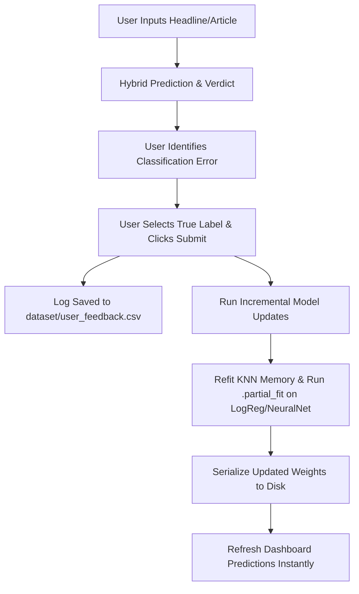

# 📰 AI-Powered Fake News Detector (From Scratch)

This repository contains a complete, production-grade Machine Learning pipeline and interactive web application for classifying news articles as **Real** or **Fake**. Every single core component—from raw text cleaning, tokenization, and TF-IDF feature extraction, to four distinct classification algorithms and metric evaluation utilities—has been built **entirely from scratch** using only Python, **NumPy**, and **Pandas** (without relying on `scikit-learn` or `nltk` for modeling).

The application is accompanied by a modern, responsive **Streamlit** dashboard featuring real-time training, parameter customization, exploratory data analysis (EDA), live article testing, and a hybrid decision engine incorporating live search APIs and LLM verification.

---

## 📂 Project Structure & Architecture

All source files are organized logically in the workspace:

- **Text Preprocessing**: [preprocessing.py](file:///c:/Users/ROHIT/Desktop/fake%20news/src/preprocessing.py)  
  Handles HTML tag stripping, URL filtering, casing normalization, dateline/publisher signature purging, and stopword removal.
- **Feature Extraction**: [features.py](file:///c:/Users/ROHIT/Desktop/fake%20news/src/features.py)  
  Implements custom `CountVectorizer` and an L2-normalized `TfidfVectorizer`.
- **Classification Models**: [src/models/](file:///c:/Users/ROHIT/Desktop/fake%20news/src/models/)
  - [base.py](file:///c:/Users/ROHIT/Desktop/fake%20news/src/models/base.py): Abstract class enforcing standard `fit`/`predict` interfaces.
  - [logistic_reg.py](file:///c:/Users/ROHIT/Desktop/fake%20news/src/models/logistic_reg.py): L2-regularized mini-batch gradient descent classifier supporting online updates (`partial_fit`).
  - [neural_net.py](file:///c:/Users/ROHIT/Desktop/fake%20news/src/models/neural_net.py): Feedforward Multi-Layer Perceptron (MLP) with Xavier initialization, backpropagation, and mini-batch SGD supporting online updates (`partial_fit`).
  - [random_forest.py](file:///c:/Users/ROHIT/Desktop/fake%20news/src/models/random_forest.py): Ensemble of Decision Trees with Gini/Entropy impurity calculations and random sub-feature split choices.
  - [knn.py](file:///c:/Users/ROHIT/Desktop/fake%20news/src/models/knn.py): Instance-based classifier supporting Euclidean & Cosine distance calculations (Cosine is mathematically optimal for TF-IDF vectors).
- **Evaluation Utilities**: [evaluation.py](file:///c:/Users/ROHIT/Desktop/fake%20news/src/evaluation.py)  
  From-scratch implementations of Accuracy, Precision, Recall, F1-Score, Confusion Matrix, and stratified `train_test_split_scratch`.
- **Streamlit Application**: [app.py](file:///c:/Users/ROHIT/Desktop/fake%20news/app.py)  
  High-fidelity Web App featuring persistent model states, multi-model consensus, live search validation, and human-in-the-loop retraining.
- **CLI Runner**: [main.py](file:///c:/Users/ROHIT/Desktop/fake%20news/main.py)  
  Terminal-based pipeline driver for quick training and interactive tests.

---

## 🛠️ Technology Stack

1. **Language**: Python 3
2. **Numerical & Data Processing**: `numpy` (vectorized matrix computations), `pandas` (structured feedback logging & CSV operations).
3. **Frontend Dashboard**: `streamlit` (UI rendering, layout control, and session state management) styled with injected **Vanilla CSS** (supporting vibrant glassmorphic gradients, dark mode design, and responsive metric cards).
4. **Data Visualization**: `matplotlib` and `seaborn` (for loss convergence curves, confusion matrices, and model comparison graphs).
5. **Serialization**: `pickle` (for saving and loading vectorizer and trained model parameters).
6. **APIs & Fact Checking**:
   - **NewsAPI** & **NewsData.io** (via `requests` for live web reference checks).
   - **Gemini API** (for semantic contradiction checking and LLM fact verification).

---

## 🧠 Classification Methodology

To classify news reliably and prevent common machine learning pitfalls, the system executes a three-part pipeline: **Leakage Mitigation & Preprocessing**, **Stylistic & Lexical Feature Engineering**, and **From-Scratch Classifiers**.

### 1. Leakage Mitigation & Preprocessing
A major issue with the ISOT Fake News Dataset (and text classification datasets in general) is **target leakage / shortcut learning**. For example, 99.8% of real articles contain publisher-specific strings like `"Reuters"`, which makes it easy for models to reach >99% accuracy simply by looking for the publisher's signature rather than learning genuine semantic signals.

Our preprocessing pipeline in [preprocessing.py](file:///c:/Users/ROHIT/Desktop/fake%20news/src/preprocessing.py) solves this via:
- **Publisher Cleansing (`strip_datelines_and_leakage`)**: Uses regular expressions to match and strip standard agency datelines, e.g., `WASHINGTON (Reuters) -` or `SEOUL/LONDON (Reuters) --` and explicitly purges occurrences of `"reuters"`.
- **Text Cleansing**: Lowercases the text, strips HTML tags, filters out URL matches, replaces punctuation with single spaces, and normalizes whitespaces.
- **Stopword Filtering**: Removes trivial words using a local set of 150+ standard English stopwords to eliminate external downloads and maintain high performance.

### 2. Lexical & Stylistic Feature Engineering
Our feature extractor in [features.py](file:///c:/Users/ROHIT/Desktop/fake%20news/src/features.py) converts raw clean strings into numerical vectors:
- **CountVectorizer**: Computes a vocabulary of the top $V$ most frequent terms and transforms documents into a dense term-frequency matrix.
- **TfidfVectorizer**: Implements smooth Inverse Document Frequency calculation:
$$\text{IDF}(t) = \log\left(\frac{1 + N}{1 + \text{DF}(t)}\right) + 1$$
and applies **L2 Normalization** to keep document vectors independent of length.
- **Stylistic Features**: Extracted dynamically inside the app during prediction:
  1. **Uppercase Density**: Ratio of uppercase letters to total characters.
  2. **Exclamation Density**: Count of exclamation marks normalized by text length.
  
  These numerical values are appended to the TF-IDF representation, giving the classifiers extra stylistic features to catch sensationalist, loud, or clickbait tones common in fabricated reporting.

### 3. Classification Algorithms (Built From Scratch)
- **Logistic Regression (`LogisticRegressionClassifier`)**: Computes classification probabilities using the Sigmoid function. Optimizes weights and biases via Gradient Descent with $L_2$ regularization:
$$w \leftarrow w - \eta \left( \frac{1}{m} X^T (\hat{y} - y) + \frac{\lambda}{m} w \right)$$
- **Simple Neural Network (`SimpleNeuralNetwork`)**: A feedforward multi-layer perceptron (Input $\rightarrow$ Hidden $\rightarrow$ Output) with Xavier weight initialization and backpropagation utilizing mini-batch SGD.
- **Random Forest (`RandomForestClassifier`)**: Constructs an ensemble of Decision Trees. Splits nodes by evaluating **Information Gain** (supporting both Gini Impurity and Entropy criteria) while subsampling features at each split to ensure model diversity and prevent overfitting.
- **K-Nearest Neighbors (`KNNClassifier`)**: Performs voting based on closest training examples. Supports **Cosine Distance**, which measures the angle between normalized text vectors and is mathematically superior to Euclidean distance for sparse text representations:
$$D_{\text{cosine}}(u, v) = 1 - \frac{u \cdot v}{\|u\|_2 \|v\|_2}$$

---

## 🔄 User Feedback & Human-in-the-Loop (HITL) Continuous Learning

To simulate a production environment, the application includes a real-time feedback system that enables continuous improvement without retraining the entire dataset:



### How the Feedback Loop Works:
1. **Interactive Refinement**: If a user notices a wrong verdict in the **Live Predictor** tab, they can specify the corrected label ("Real News" or "Fake News") and hit **Submit & Train Instantly**.
2. **Online Parameter Adjustments**: The system fetches the corrected article, passes it through the preprocessing and TF-IDF pipeline, and runs **incremental learning steps**:
   - For **Logistic Regression** and **Neural Network**, it calls `partial_fit()` to update the model weights slightly in the direction of the correction.
   - For **K-Nearest Neighbors**, it appends the vector and label directly to the internal training matrix.
   - *Note: Since Random Forest cannot be trained incrementally, it is left untouched during online steps.*
3. **Immediate Serialization**: The refined models are immediately saved back to their on-disk pickles, ensuring changes persist across page reloads.
4. **Data Aggregation for Re-Training**: The raw corrected text and labels are written to `dataset/user_feedback.csv`. When a user runs a full training cycle ("Train All Models" in the sidebar), the system merges all accumulated historical feedback entries from this CSV with the original dataset, allowing all models (including Random Forest) to learn from past user corrections in batch.

---

## 🛡️ Hybrid Credibility Verification Engine

Relying solely on text style can lead to false positives (e.g., satire or true stories written dramatically). The web app implements a **Hybrid Credibility Engine** that integrates stylistic models with live fact verification:

1. **Live Source Cross-Referencing (40% Weight)**: Extracting key search terms from the input text, the app performs real-time queries across two news endpoints (**NewsAPI** and **NewsData.io**). The resulting coverage determines the cross-reference score.
2. **LLM Fact Checker (40% Weight)**: Retrieved search snippets are compiled and fed to **Gemini API** to run a semantic contradiction check, generating a reliability verdict based on facts, not writing style.
3. **ML Model Consensus (20% Weight)**: Average prediction output of the 4 custom classifiers.
4. **Zero-Coverage Penalty (Override Rule)**: If no live news articles are found matching the query, the credibility score is immediately **capped at 20%** to prevent styled fake stories from receiving a high verification rating.

---

## 🚀 Getting Started

### Prerequisites
Install all requirements listed in `requirements.txt`:
```bash
pip install -r requirements.txt
```

### 1. Launch the Streamlit Web Application
To start the dashboard and view the interactive panels:
```bash
streamlit run app.py
```
Open `http://localhost:8501` to use the application.

### 2. Run the Command Line Interface (CLI)
To run a batch training sequence and prediction loop from the terminal:
```bash
python main.py --samples 2000 --vocab_size 1000 --test_split 0.2
```
Options:
- `--samples`: Total articles to load (balanced between Real and Fake).
- `--vocab_size`: Maximum features for TF-IDF extraction.
- `--test_split`: Validation split fraction.

---

## 📊 Benchmark Results

On a balanced subset of 2,000 articles using a vocabulary size of 1,000 features, the custom classifiers yielded the following results:

| Model Name | Test Accuracy | Test Precision | Test Recall | Test F1-Score | Training Time |
| :--- | :---: | :---: | :---: | :---: | :---: |
| **Simple Neural Network** | **97.25%** | **97.52%** | **97.04%** | **97.28%** | ~11.60s |
| **Logistic Regression** | **92.00%** | **98.31%** | **85.71%** | **91.58%** | ~0.34s |
| **Random Forest** | **90.50%** | **98.82%** | **82.27%** | **89.78%** | ~6.14s |
| **K-Nearest Neighbors** | **81.75%** | **91.67%** | **70.44%** | **79.67%** | ~0.01s |
